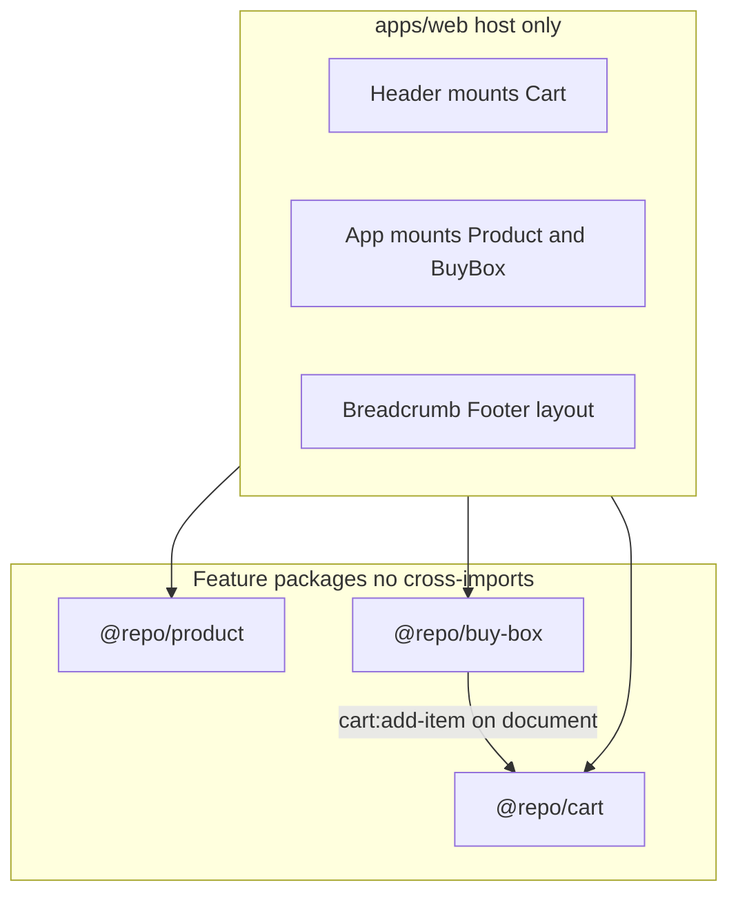

# Modular monolith — e-commerce product page

A demo e-commerce **product page** (Nintendo Switch 2) built as an **MBA conclusion work** artifact. The project explores whether a [modular monolith](https://www.kamilgrzybek.com/blog/posts/modular-monolith-primer) scales better than [micro frontends](https://micro-frontends.org/), especially for **smaller teams**.

## Research context

**Goal:** Validate that a modular monolith is a strong fit for growth compared to splitting the same boundaries into micro frontends—without the operational overhead that often hurts small teams.

**Why this domain:** An e-commerce product page has clear, familiar boundaries (catalog content, offer/purchase, cart) and is easy to reason about and measure. The author has prior experience in this space.

**Hypothesis metrics:**

| Metric | How it is observed in this repo |
|--------|----------------------------------|
| **Build time** | Turbo task timing in local/CI logs (`npm run build`) |
| **Artifact count & size** | [`scripts/report-build-artifacts.mjs`](scripts/report-build-artifacts.mjs) after build; [GitHub Actions](https://docs.github.com/en/actions) appends a table to the job summary and uploads **`web-dist`** |

**Credits:** Page layout was informed by [Google Stitch](https://stitch.withgoogle.com/) (AI-assisted UI design). The codebase was built with [Cursor](https://cursor.com/) as the IDE, using its LLMs alongside manual review.

## How this repo models “MFE vs monolith”

Three **feature packages** behave like independent micro-frontends:

- Separate **public APIs** (`@repo/product`, `@repo/buy-box`, `@repo/cart`)
- **No cross-imports** between feature packages
- **Duplicated** cart event contract in buy-box and cart (no shared integration package)

They ship as a **single deployable**: one Vite host ([`apps/web`](apps/web/README.md)) that only mounts components. Add-to-cart does **not** go through the host—buy-box publishes on `document`, and cart subscribes ([`publishAddToCart`](packages/buy-box/src/api/publish-add-to-cart.ts) → [`subscribeToCart`](packages/cart/src/api/cart-pubsub.ts)).

All packages align on product id `nintendo-switch-2`. A mismatch causes the cart to no-op (intentional boundary demo).



## Repository map

| Path | Role | README |
|------|------|--------|
| [`apps/web`](apps/web) | Host shell (layout, header cart mount) | [apps/web/README.md](apps/web/README.md) |
| [`packages/product`](packages/product) | Product gallery & details | [packages/product/README.md](packages/product/README.md) |
| [`packages/buy-box`](packages/buy-box) | Offer & add-to-cart publisher | [packages/buy-box/README.md](packages/buy-box/README.md) |
| [`packages/cart`](packages/cart) | Cart UI & catalog subscriber | [packages/cart/README.md](packages/cart/README.md) |
| [`packages/config`](packages/config) | Shared Tailwind + TypeScript presets | [packages/config/README.md](packages/config/README.md) |

## Tech stack

Short guide for readers new to front-end engineering. Each link goes to official docs or a widely used overview.

| Tool | What it does in this project | Learn more |
|------|------------------------------|------------|
| [Node.js](https://nodejs.org/) | JavaScript runtime used to run builds, tests, and dev tools (pinned **24.15.0** in [`.nvmrc`](.nvmrc)) | [nodejs.org](https://nodejs.org/en/docs) |
| [nvm](https://github.com/nvm-sh/nvm) | Installs and switches Node versions per machine | [nvm README](https://github.com/nvm-sh/nvm#readme) |
| [npm](https://www.npmjs.com/) | Package manager; **workspaces** link `apps/*` and `packages/*` in one repo | [npm workspaces](https://docs.npmjs.com/cli/v11/using-npm/workspaces) |
| [Turborepo](https://turbo.build/) | Runs `build`, `test`, and `dev` across packages with caching | [turbo.build](https://turbo.build/repo/docs) |
| [React](https://react.dev/) | UI library for components (product, buy-box, cart, host) | [react.dev Learn](https://react.dev/learn) |
| [Vite](https://vite.dev/) | Dev server and production bundler for `apps/web` | [vite.dev guide](https://vite.dev/guide/) |
| [TypeScript](https://www.typescriptlang.org/) | Typed JavaScript; catches errors before runtime | [TS handbook](https://www.typescriptlang.org/docs/handbook/intro.html) |
| [Tailwind CSS](https://tailwindcss.com/) | Utility-first styling shared via `@repo/config` | [Tailwind docs](https://tailwindcss.com/docs) |
| [Biome](https://biomejs.dev/) | Linter and formatter (replaces ESLint + Prettier here) | [biomejs.dev](https://biomejs.dev/guides/getting-started) |
| [Vitest](https://vitest.dev/) | Fast unit tests for packages and host | [vitest.dev](https://vitest.dev/guide/) |
| [Playwright](https://playwright.dev/) | End-to-end browser tests (full user flows) | [playwright.dev](https://playwright.dev/docs/intro) |
| [GitHub Actions](https://github.com/features/actions) | CI: build, artifact report, tests on every PR | [Actions docs](https://docs.github.com/en/actions) |

**Bundling note:** Vite 8 uses [Rolldown](https://rolldown.rs/) under the hood (see [troubleshooting](#troubleshooting) if native bindings fail on WSL/Linux).

## Getting started

From the repo root, use the pinned Node version:

```sh
source ~/.nvm/nvm.sh && nvm use && export PATH="$HOME/.nvm/versions/node/v$(cat .nvmrc)/bin:$PATH"
npm ci
npm run dev        # all workspaces via Turbo
npm run build
```

Open the dev URL printed by Vite (typically `http://localhost:5173`).

## Scripts

| Command | Purpose |
|---------|---------|
| `npm run dev` | Start dev servers (Turbo) |
| `npm run build` | Build feature packages (`dist/`) and the web app |
| `npm run report-build-artifacts` | Print web bundle file count and sizes (run after `build`) |
| `npm run type-check` | `tsc --noEmit` across the monorepo |
| `npm run format-and-lint` | Biome check |
| `npm run test` | Vitest in all workspaces |
| `npm run test:e2e` | Playwright (builds first via Turbo) |
| `npm run test-coverage` | Unit tests + merged coverage report |

**Note:** On a clean checkout, run `npm run build` before `type-check` if `web` cannot resolve workspace types from `dist/*.d.ts`.

## CI

[GitHub Actions](https://docs.github.com/en/actions) ([`.github/workflows/ci.yml`](.github/workflows/ci.yml)) runs on push to `main` and on pull request open/sync.

| Job | What runs |
|-----|-----------|
| **Build and Quality** | `format-and-lint` → `build` → artifact report → upload `web-dist` → `type-check` → `test-coverage` |
| **E2E Tests** | `needs: build` → download `web-dist` → Playwright → `test:e2e --workspace=web` |

E2E setup, preview server, and visual snapshots: [`apps/web/README.md`](apps/web/README.md).

## Troubleshooting

### `Cannot find native binding` / `@rolldown/binding-…` during build

**Symptom:** `npm run build` or `vite build` fails in `web` with `Cannot find native binding` or `Cannot find module '@rolldown/binding-…'`.

**Cause:** [Vite](https://vite.dev/) 8 uses [Rolldown](https://rolldown.rs/), which needs a platform-specific native binding (e.g. `@rolldown/binding-linux-x64-gnu` on Linux/WSL). npm sometimes skips these optional dependencies in workspaces ([npm/cli#4828](https://github.com/npm/cli/issues/4828)).

**Fix:** From the repo root, with Node **24.15.0** (`nvm use` — see [`.nvmrc`](.nvmrc); Rolldown requires `^20.19.0 || >=22.12.0`):

```sh
rm -rf node_modules
npm ci
```

**Verify:** `node_modules/@rolldown/binding-<platform>` exists (e.g. `binding-linux-x64-gnu` on Linux x64).

**If it recurs:** Delete `package-lock.json` as well and run `npm install`. As a durable workaround, add the matching `@rolldown/binding-*` package to root `optionalDependencies` (version synced to Vite's pinned Rolldown).

## Further reading

Contributor conventions (pub/sub, public API, async fetch patterns): [`.cursor/rules/project-guidelines.mdc`](.cursor/rules/project-guidelines.mdc).
