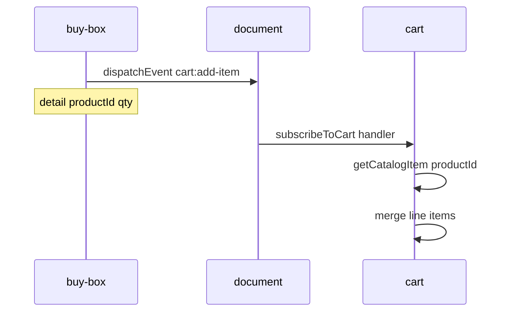

# `@repo/buy-box` — offer and add to cart

Feature package for the **purchase box**: price, installments, quantity, and the add-to-cart action.

## What shoppers see

- Current price and installment text
- Quantity stepper (minimum 1)
- Primary “add to cart” button

Offer data is simulated for **Nintendo Switch 2** (`OFFER_PRODUCT_ID`: `nintendo-switch-2`).

## Boundaries

**Owns:**

- Offer mock API and UI for purchase controls
- Publishing add-to-cart commands to the browser event bus

**Does not own:**

- Product gallery or description ([`@repo/product`](../product/README.md))
- Cart UI, catalog, or line-item merge ([`@repo/cart`](../cart/README.md))
- **Must not** import `@repo/cart` or any other feature package

## Public API

Consumers import **only** from `@repo/buy-box`.

| Export | Description |
|--------|-------------|
| `<BuyBox />` | Container: loads offer, renders buy box |
| `buyBoxAPI` | Namespace for programmatic access |

Key `buyBoxAPI` symbols:

- `getOffer(options?)` — simulated fetch; default `latencyMs: 300`
- `publishAddToCart(command)` — dispatches `cart:add-item` on `document`
- `OFFER_PRODUCT_ID`, `AddToCartCommand`, `CART_ADD_ITEM_EVENT`

Example:

```ts
import { BuyBox, buyBoxAPI } from "@repo/buy-box";

buyBoxAPI.publishAddToCart({
  productId: buyBoxAPI.OFFER_PRODUCT_ID,
  quantity: 1,
});
```

## Cart integration (pub/sub)

Buy-box is the **publisher**. It sends only `{ productId, quantity }`—no product title, price, or image. Cart resolves `productId` against its own catalog.



| Piece | File |
|-------|------|
| Event contract (duplicated in cart) | [`src/api/cart-events.ts`](src/api/cart-events.ts) |
| Publisher | [`src/api/publish-add-to-cart.ts`](src/api/publish-add-to-cart.ts) |
| Offer API | [`src/api/offer.ts`](src/api/offer.ts) |

The event name is `cart:add-item` (`CustomEvent` on **`document`**, not `window`).

## Implementation pattern

```
BuyBoxContainer → useOffer → BuyBoxViewSkeleton | BuyBoxView
                    ↓
               getOffer()
```

Button click calls `publishAddToCart` with the selected quantity.

## Simulated backend

`getOffer` uses the same latency pattern as product (default **300 ms**; `latencyMs: 0` in tests).

## Commands

From the **repo root**:

```sh
npm run build --workspace=@repo/buy-box
npm run test --workspace=@repo/buy-box
```

From this directory:

```sh
npm run build
npm run test
```

## Host usage

[`apps/web`](../../apps/web/README.md) renders `<BuyBox />` beside `<Product />` in `App`. The host does not listen for cart events.

## See also

- [Root README](../../README.md)
- [`@repo/cart`](../cart/README.md) (subscriber)
- [`@repo/product`](../product/README.md)
- [`apps/web`](../../apps/web/README.md)
