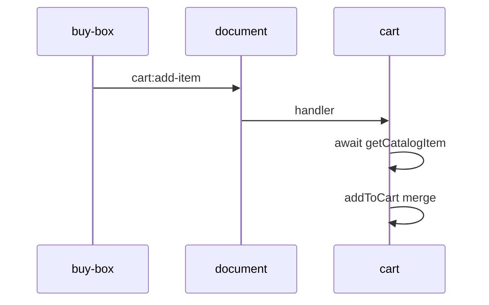

# `@repo/cart` — shopping cart

Feature package for the **header cart**: line items, totals, and reacting to add-to-cart events from buy-box.

## What shoppers see

- Cart control in the site header (mounted by the host)
- Line items with title, quantity, and price after items are added
- Updates when buy-box publishes an add-to-cart command

Catalog entries are simulated for **Nintendo Switch 2** (`CATALOG_PRODUCT_ID`: `nintendo-switch-2`).

## Boundaries

**Owns:**

- Cart UI and in-memory cart store
- Catalog lookup when merging a new line
- Subscribing to `cart:add-item` on `document`

**Does not own:**

- Product page or offer UI
- Publishing add-to-cart ([`@repo/buy-box`](../buy-box/README.md))
- **Must not** be imported by buy-box or product

If `productId` does not match the cart catalog, the add is a **silent no-op**—by design, to show strict package boundaries.

## Public API

Consumers import **only** from `@repo/cart`.

| Export | Description |
|--------|-------------|
| `<Cart />` | Container: subscribes to store, renders cart view |
| `cartAPI` | Namespace for programmatic access |

Key `cartAPI` symbols:

- `subscribeToCart(handler)` / `unsubscribeFromCart(handler)` — document event bus
- `getCartItems()` — current line items (for tests and store bridge)
- `getCatalogItem(productId, options?)` — simulated catalog fetch; default `latencyMs: 300`
- `addToCart(items, command, catalogItem)` — sync merge (used after catalog resolves)
- `CATALOG_PRODUCT_ID`, `CartLineItem`, `CatalogItem`

Example:

```ts
import { Cart, cartAPI } from "@repo/cart";

const items = cartAPI.getCartItems();
```

## Cart integration (pub/sub)

Cart is the **subscriber**. On `cart:add-item`, it loads catalog data, then merges into the store. Concurrent adds are serialized on a promise chain.



| Piece | File |
|-------|------|
| Event contract (duplicated in buy-box) | [`src/api/cart-events.ts`](src/api/cart-events.ts) |
| Subscribe / unsubscribe | [`src/api/cart-pubsub.ts`](src/api/cart-pubsub.ts) |
| Store + React bridge | [`src/api/cart-store.ts`](src/api/cart-store.ts) |
| Catalog API | [`src/api/catalog.ts`](src/api/catalog.ts) |

`<Cart />` uses `useSyncExternalStore(subscribeToCartStore, getCartItems)`—not `useEffect` on the bus. `subscribeToCart` does not return teardown; use `unsubscribeFromCart` explicitly.

## Implementation pattern

- **On mount:** cart container wires pub/sub and store subscription
- **On add:** async `getCatalogItem` → sync `addToCart`
- **Render:** [`cart-view.tsx`](src/components/cart-view.tsx) from store snapshot

## Simulated backend

Catalog lookup is async (default **300 ms**). The merge function `addToCart` is **synchronous** and does not accept `latencyMs`. Tests use `getCatalogItem(..., { latencyMs: 0 })` and fixture `CatalogItem` values for store/unit tests.

## Commands

From the **repo root**:

```sh
npm run build --workspace=@repo/cart
npm run test --workspace=@repo/cart
```

From this directory:

```sh
npm run build
npm run test
```

## Host usage

[`apps/web`](../../apps/web/README.md) mounts `<Cart />` in `Header` only. No cart props or providers are passed from the host.

## See also

- [Root README](../../README.md)
- [`@repo/buy-box`](../buy-box/README.md) (publisher)
- [`@repo/product`](../product/README.md)
- [`apps/web`](../../apps/web/README.md)
